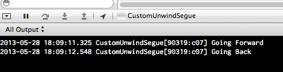
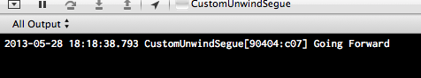

# Custom Unwind Segues in UINavigationControllers

I'm trying to trigger a custom unwind segue from a button in my second view 
controller (not the UINavigationController's back button).

If the view controllers are not embedded in a UINavigationController, 
everything works fine. If they *are*, things go a little wonky.

## What I'm expecting

If you open MainStoryboard.storyboard and delete the main 
UINavigationController then run the app, everything works as expected.

Tap the button to go to the second UIViewController, then tap either
of the UIButtons to trigger the unwind segue.

You'll get the following in your Console:

## What actually happens

Undo the above changes, so the UINavigationController is back in the 
storyboard. Then run the project again.

Do the same thing as last time, and notice the difference in the
Console:

## It's fixed!

After submitting a request to Apple DTS, they suggested I use a 
UINavigationController subclass. That worked.

See the working version in the `DTS_Response` branch.